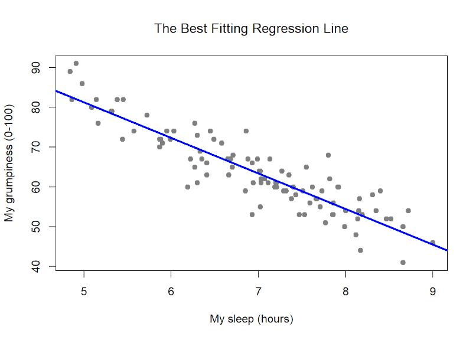

```{r setup, include=FALSE}
options(htmltools.dir.version = FALSE)
library(emo)
library(fontawesome)
```

class: middle center inverse

**10.00** Quick Introduction (30 min)

**10.35** Follow on worksheets (approx. 45 minutes)

**11.15** Take a break and recharge (15 mins)

**11.30** Continue with worksheets (approx. 1 hour and 15 minutes)

**12.45** Workshop ends

---

class: top left inverse

# What do we focus on today?

Today we will explore more advanced topics in data analysis.

1. Experimental Design and Data Preprocessing
2. Counting Responses (Contingency Tables)
3. Within-Subject Differences and Interactions (ANOVA)
4. Statistical Predictions (Regression, Linear Models)

---

class: middle center inverse

<iframe width="1200" height="600" src="https://www.youtube.com/embed/FN2RM-CHkuI" title="YouTube video player" frameborder="0" allow="accelerometer; autoplay; clipboard-write; encrypted-media; gyroscope; picture-in-picture" allowfullscreen></iframe>

---

class: middle center inverse

# Experimental Design


---

class: top left inverse

# Experimental Design

> Reliable statistics and good experimental design go hand in hand.

You have to know what statistics you'll need to make sure you have to correct experiment, the right sample size

# Data Preprocessing

80% of researchers time spent on data preprocessing.

* It can be substantially reduced by thinking ahead in the experimental design stages.
* Preprocessing is just as important as the test that tells you whether your hypothesis is correct.

---

class: middle center inverse

# Remember that data analysis (at least in psychology) is largely about testing hypothesis about your data!

---

class: top left inverse

# Contingency Tables

## First set of techniques will be relevant for categorical (nominally valued) data.

* Measures are distributed into non-overlapping categories
* Imagine you ask people to draw a card from a deck
* Possible draws are: clubs, diamonds, spades, hearts.
    * *H<sub>0</sub>*: $P = (0.25, 0.25, 0.25, 0.25)$
    * *H<sub>1</sub>*: $P \neq (0.25, 0.25, 0.25, 0.25)$

#### The goal here is to determine whether your data is random or something more lawful.

---

class: top left inverse

# Analysis of variance - ANOVA

This is the most used technique in psychology — a special case of regression.
This also means this is the most misused technique out there.

* It allows comparing *groups* $\geq$ 3.
* It tests for interactions — differences of the differences between various combinations of groups.
* $H_0$ : No difference between groups and within groups.
* $H_1$ : At leats one group is different.

---

class: top left inverse

# Regression

<br><br><br>

Regression tests for the relationships between a set of variables and outcomes.
It is a *slightly fancier* version of a simple correlation.

**The goal is to find what is the best.**

.footnote[

.bold[*] Gordon, R.A. (1968). Issues in Multiple Regression. American Journal of Sociology, 73, 592 - 616.

]

---

class: middle center inverse



---

class: top left inverse

# Worksheets

Here are the worksheets in the order you should go through them.
They are part of [RMINR](https://www.andywills.info/rminr/#vbgtr), that has been developed at the University of Plymouth as an in-house teaching material.
The last worksheet is part of [lifesavR](https://benwhalley.github.io/lifesavR/).

* [Data preprocessing](https://www.andywills.info/rminr/preproc.html): Getting data from lab-based (OpenSesame) experiments into a format closer to something you can actually analyse, in five steps: loading, selecting, filtering, summarising, and combining. Also covers combining data frames, renaming columns.
* [Relationships](https://www.andywills.info/rminr/chi.html): Frequency and contingency tables. Mosaic plots. Traditional chi-square test. Bayesian test.
* [Within-subject differences](https://www.andywills.info/rminr/anova1.html): data preprocessing (pivoting and mutating). One-factor within-subject Bayesian ANOVA. Pairwise comparisons, multiple comparisons.
* [Understanding Interactions](https://www.andywills.info/rminr/anova2.html): Learn what an interaction is, and learn how to do line plots at the same time.
* [Making Predictions](https://benwhalley.github.io/lifesavR/session-6.html): linear regression, scatterplots, three main assumptions for regression.

---

class: top left inverse

# Additional Resources

* [Contingency Tables for More Thorough Comparisons](https://danmaclean.github.io/bayes_factors/bayes_proportion.html): in case you want to compare the groups of counts in multiple different ways, this brief worksheet gives some suggestions on how to do it.
* [Learning Statistics with R](https://learningstatisticswithr.com/book/): This is a free online textbook that also has a downloadable [PDF](https://learningstatisticswithr.com/) version. The book emphasizes statistical techniques that we try to avoid nowadays, but it nonetheless provides insight into the inferential statistical thinking we all practice.
* [Bayesian ANOVA for PROS](https://www.andywills.info/rminr/anova5.html):  doing two-factor within-subjects Bayesian ANOVA better.

---

class: top left inverse

# Contacts

If you have any questions about R, statistics, research in general, do not hesitate to contact me:

`r emo::ji("man")` lenard.dome@plymouth.ac.uk

* `r emo::ji("chart")` Slides are availabe at [lenarddome.github.io/teaching](https://lenarddome.github.io/teaching/)
* `r emo::ji("notebook")` All other material, including notes, can be found on [GitHub `r fontawesome::fa("github")`](https://github.com/lenarddome/CPSY622-introduction-to-data-analysis)

<!-- style -->

<style>

body {
  background: #2e3440;
}

h1.title {
  color: #a3be8c;
}

h1.subtitle {
  font-size: 42px;
}

.container{
    display: flex;
}

.col{
    flex: 1;
}

div.sourceCode {
  background-color: #2e3440;
}

.sourceCode {
  background-color: #393f4b;
}

.reveal section img {
  border: 30px solid #e0e1e2;
  border-radius: 10px;
  display: block;
  margin-left: auto;
  margin-right: auto;
  }

.reveal p {
  text-align: left;
}

.reveal ul {
  display: block;
}

.reveal ol {
  display: block;
}

</style>
